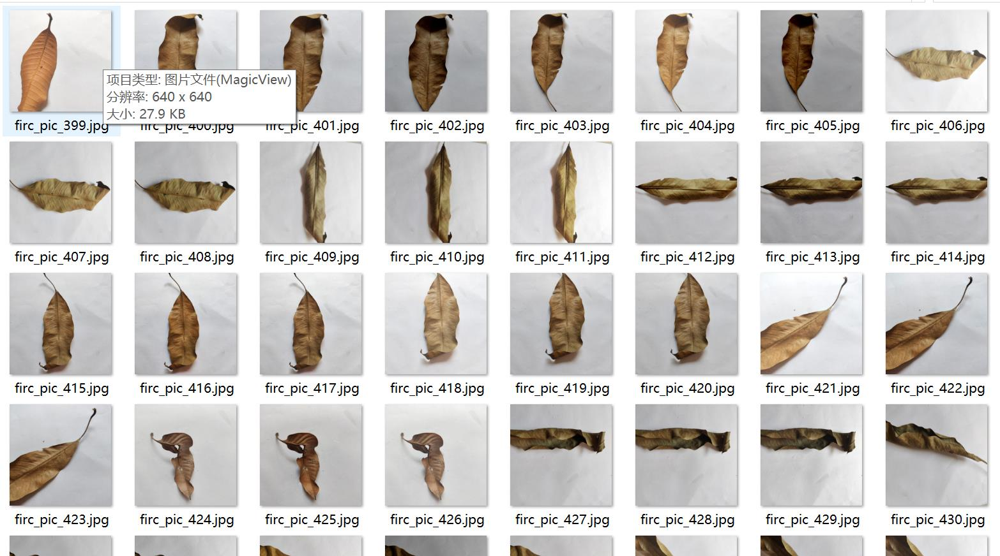
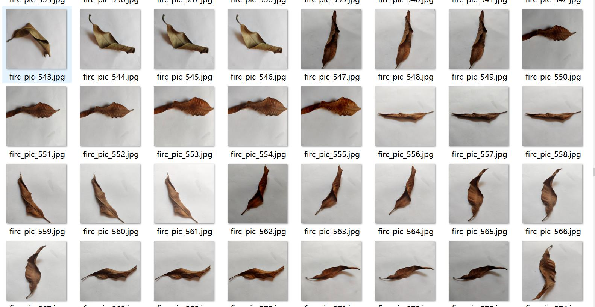
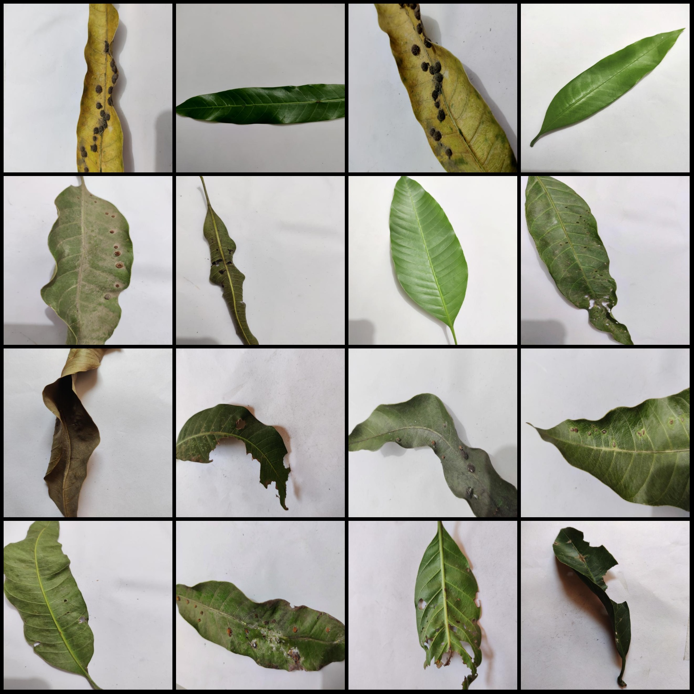
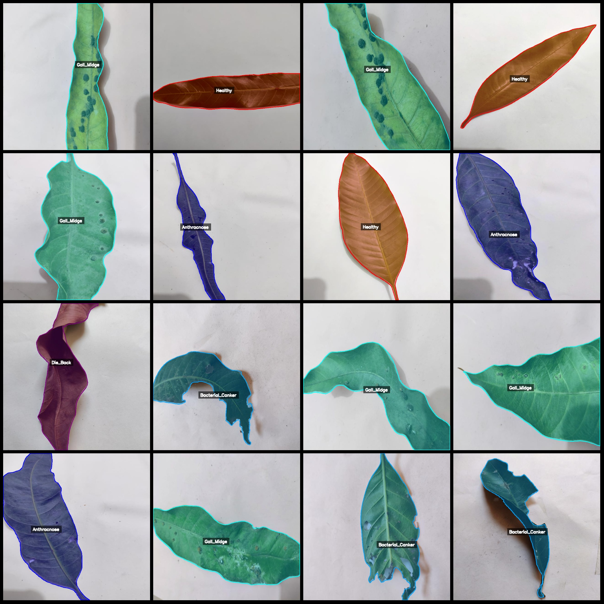
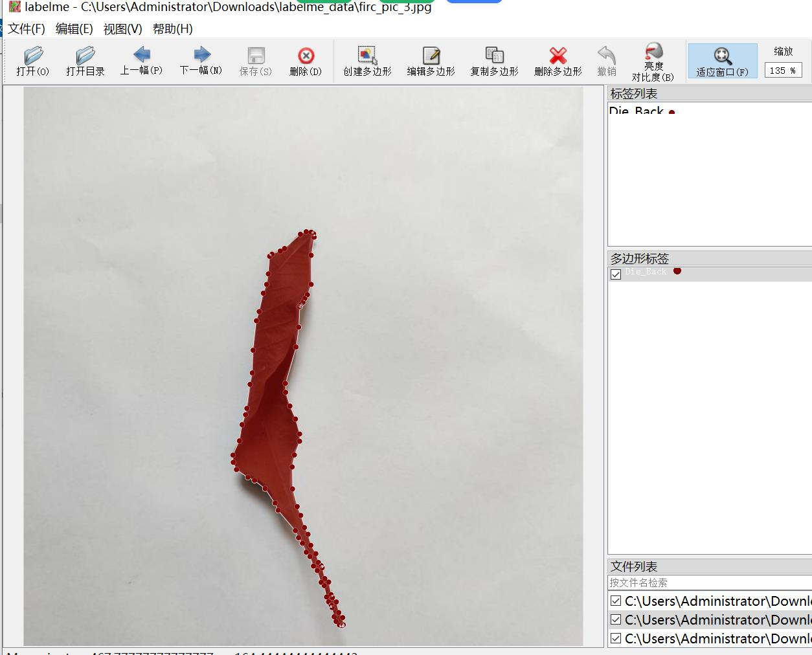

# Mango Leaf Disease Identification and Segmentation Dataset in LabelMe Format with 3642 Images of 5 Categories

Please note that approximately one-third of the images are original, while the remaining are enhanced images.
The dataset is in labelme format without a mask file; it only contains JPG images and their corresponding JSON files.
There are 3642 JPG files in total, and there are 3642 JSON files.
The number of categories in the dataset: 5
The categories in the JSON files are: ["Anthracnose", "Bacterial_Canker", "Die_Back", "Gall_Midge", "Healthy"]
Each category has an equal number of bounding boxes:
Anthracnose count = 420
Bacterial Canker count = 789
Die Back count = 750
Gall Midge count = 900
Healthy count = 783
Total bounding box count: 3642

Annotation tool used: labelme=5.5.0
Image resolution: 640x640
Annotation rules: Polygons are drawn around the categories.
Important Note: The dataset can be edited in labelme. The JSON dataset needs to be converted into either mask or yolo format or coco format for semantic segmentation or instance segmentation.
Special Disclaimer: This dataset does not guarantee the accuracy of the trained models or weight files.

Image Preview:
Annotation Example:
Randomly selected 16 images for annotation:
Annotation drawing results:
LabelMe editing image example:
Image

Here is a pay link on Stripe ( https://buy.stripe.com/3cs8yP7sY87d0vu9AB ). Please contact me lonlonago@foxmail.com after funding $89, and I will send you a complete data files , thank you!

